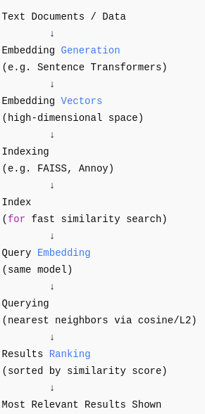

## Vector Search Overview

Vector search is a technique for finding similar items based on their vector representations (embeddings). Here's how it works:

### Process Flow

1. **Embedding Generation**  
   Text content is converted to dense vector representations using models like sentence transformers. These embeddings capture semantic meaning in a high-dimensional space.

2. **Indexing**  
   The vectors are stored in specialized data structures (like FAISS) optimized for fast similarity search. These indexes organize vectors to enable efficient nearest neighbor searches.

3. **Querying**  
   When searching, the query is converted to an embedding, and the index finds the closest vectors using similarity metrics like cosine similarity or L2 distance.

4. **Results Ranking**  
   The most similar vectors are returned, with their similarity scores, allowing relevant results to be ranked by relevance.